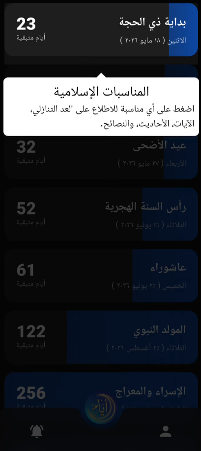

<div align="center">

# أيام — Ayyam App

**Your companion to seize the seasons of goodness**

[](https://flutter.dev)
[](https://dart.dev)
[](LICENSE)
[](https://github.com/mohamed-hassan-pro/ayyam-app/releases)
[](https://github.com/mohamed-hassan-pro/ayyam-app/releases)

</div>

---

## 📖 About

**Ayyam** (أيام — *"Days"* in Arabic) is a bilingual Islamic events tracker that helps Muslims stay connected to the sacred seasons of the Islamic calendar. It tracks major Islamic events with real-time Hijri ↔ Gregorian date conversion, shows countdowns to upcoming events, and delivers smart local notifications so you never miss a blessed day.

---

## ✨ Features

| Feature | Description |
|---|---|
| 🌙 **Islamic Event Tracker** | Tracks major Islamic events (Ramadan, Eid, Hajj season, Ashura, etc.) with accurate dates |
| 📅 **Hijri Calendar** | Full Hijri ↔ Gregorian date conversion using real Hijri calculation |
| ⏳ **Countdown Timers** | Dynamic countdowns showing days remaining to each event |
| 🔔 **Smart Notifications** | Configurable local notifications (1 week, 1 month, 3 months, 6 months before events) |
| 📖 **Rich Event Details** | Quran verses, Prophetic hadiths, recommended practices, and preparation tips per event |
| 🌐 **Bilingual** | Full Arabic & English support with RTL layout |
| 🎨 **Theming** | Dark mode, light mode, system default, and 10 customizable card accent colors |
| 💾 **Offline Support** | Events cached locally with Hive — works without internet after first load |
| 🎓 **App Tour** | Interactive guided tour (ShowcaseView) for new users |
| 📲 **Onboarding** | Beautiful onboarding flow with user profile setup |

---

## 🛠️ Tech Stack

| Layer | Technology |
|---|---|
| **Framework** | Flutter 3.x · Dart 3.x |
| **State Management** | BLoC / Cubit (`flutter_bloc`) |
| **Local Storage** | Hive + Hive Flutter |
| **Networking** | Dio + Aladhan API (Islamic calendar data) |
| **Routing** | GoRouter (declarative, type-safe) |
| **Notifications** | flutter_local_notifications + timezone |
| **Localization** | Flutter intl + ARB files (AR/EN) |
| **Calendar** | hijri package (Hijri date calculations) |
| **UI Extras** | font_awesome_flutter · showcaseview · permission_handler |

---

## 🏗️ Architecture

Feature-first clean architecture:

```
lib/
├── main.dart                     # App entry point
├── app.dart                      # Root widget with BLoC providers
├── core/
│   ├── constants/                # App-wide constants
│   ├── routing/                  # GoRouter configuration
│   ├── services/                 # ApiService (Dio), StorageService (Hive)
│   ├── settings/                 # Settings cubit & state (theme, language, etc.)
│   ├── theme/                    # Light/dark theme definitions
│   └── platform/                 # Platform-adaptive widgets
└── features/
    ├── home/                     # Event list, event cards, offline banner
    │   ├── data/                 # Models, local datasources, repository
    │   ├── logic/                # EventsCubit + EventsState
    │   └── presentation/         # HomeView + EventCard widget
    ├── event_details/            # Rich event detail screen
    ├── notifications/            # Notification settings & scheduling
    ├── onboarding/               # Splash screen + onboarding flow
    └── profile/                  # Profile & settings screen
```

---

## 🎬 Demo

<div align="center">

[](https://github.com/mohamed-hassan-pro/ayyam-app/raw/main/assets/ayyam_app_v1.mp4)

*Click the image to watch the demo video*

</div>

---

## 🚀 Getting Started

### Prerequisites
- Flutter SDK ≥ 3.0.0
- Dart SDK ≥ 3.0.0
- Android Studio / VS Code with Flutter extension

### Installation

```bash
# Clone the repository
git clone https://github.com/mohamed-hassan-pro/ayyam-app.git
cd ayyam-app

# Install dependencies
flutter pub get

# Run in debug mode
flutter run
```

### Build Release APK

```bash
# Optimized release APKs split per CPU architecture
flutter build apk --split-per-abi
```

Output APKs will be in:
```
build/app/outputs/flutter-apk/
├── app-armeabi-v7a-release.apk   # 32-bit ARM (older devices)
├── app-arm64-v8a-release.apk     # 64-bit ARM (most modern devices) ← recommended
└── app-x86_64-release.apk        # 64-bit x86 (emulators)
```

---

## 📥 Download

Download the latest APK for your device from the [**Releases page**](https://github.com/mohamed-hassan-pro/ayyam-app/releases/tag/v1.0.0).

| APK | Target |
|---|---|
| `app-arm64-v8a-release.apk` | ✅ Most Android phones (2017+) |
| `app-armeabi-v7a-release.apk` | Older / 32-bit devices |
| `app-x86_64-release.apk` | Android emulators |

> **Note**: Enable *"Install from unknown sources"* in your Android settings before installing.

---

## 🗺️ Roadmap

- [ ] Widget for home screen countdown
- [ ] Prayer times integration
- [ ] iOS release

---

## 👨‍💻 Developer

Built with ❤️ by **Mohamed Hassan**  
Portfolio project — open for feedback and contributions.

---

## 📄 License

This project is licensed under the MIT License.